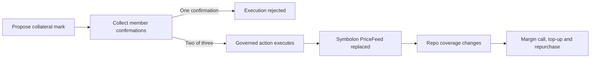

<div align="center">


# Symbolon

### Know your repayment before settlement.

**Private fixed-rate financing on Canton.**

[Live DevNet App](https://symbolon.endpx.cloud/app) · [App Demo Video](https://symbolon.endpx.cloud/demo/symbolon-app-demo-devnet.mp4) · [Pitch PDF](https://github.com/EndPx/symbolon/blob/main/docs/submission/symbolon-pitch-final-v6.pdf) · [Documentation](https://symbolon.gitbook.io/symbolon-docs/) · [Demo Guide](https://github.com/EndPx/symbolon/blob/main/docs/submission/hosted-devnet-demo.md) · [BitSafe Proof](https://github.com/EndPx/symbolon/blob/main/docs/submission/bitsafe-contribution.md)

[](https://github.com/EndPx/symbolon/actions/workflows/web.yml)
[](https://github.com/EndPx/symbolon/actions/runs/37341484064)

</div>

Symbolon helps treasury borrowers agree a financing obligation before committing to it. Borrowers request offers, lenders set their own rates, and the borrower chooses a funded quote with a fixed annualized rate, maturity and contractual repayment amount. Canton settles cash against pledged collateral atomically and records the agreement's lifecycle.

The name comes from the Greek *symbolon*: two matching halves used to recognize an agreement. Here, the two sides share agreed terms while competing lenders retain separate quotes.

> **Current demo:** shared HackCanton DevNet, authorized HackCanton accounts, simulated assets and prices. **BitSafe entry:** Contribution Pool, supported by a reproducible LocalNet integration. TestNet work is deferred; MainNet financing is not enabled.

## Why Symbolon

A floating borrowing rate can change while a position stays open. A treasury team then has to budget for interest it cannot lock at entry. Financing requests and lender pricing also reveal commercial information that counterparties may prefer to share selectively.

| Capability | What it gives the user |
| --- | --- |
| **Fixed contractual repayment** | Review principal, annualized APR, term interest and the amount due before accepting. Later rate changes do not reprice that agreement. |
| **Open requests, private quotes** | Publish the request once with consent to share its terms with connected Symbolon users. New lenders set their APR and fund a bilateral quote directly, without registration or per-lender access approval. |
| **Controlled visibility and atomic settlement** | Compare bilateral offers while Canton enforces authorization and the simultaneous cash/collateral exchange. |

The value is repayment predictability. Fixed financing does not guarantee cheaper borrowing or remove collateral and counterparty risk. Network charges remain separate. The initial customer hypothesis is a treasury operator at a small or mid-sized digital-asset fund with Canton exposure or a concrete adoption plan.

## The borrower and lender journey


1. **Publish a request.** The borrower specifies principal, term and collateral conditions and agrees to share them with connected Symbolon users. This creates an `OpenRequest` on Canton and publishes its verified disclosure; it does not move assets.
2. **Review the shared request.** Any authorized Symbolon account can read the borrower identity, amount, collateral and duration without registration or access approval. The unauthenticated web board exposes only a listing ID, market, status and time.
3. **Price and fund a quote.** Each lender chooses its APR. Sending a funded quote reserves the exact cash amount; it does not settle financing.
4. **Compare and settle.** The borrower accepts a funded quote. Cash reaches the borrower while collateral transfers to the lender under the position's restrictions. For a linked open request, the app also withdraws the active request and declines its other known recorded active quotes atomically. Unrelated or unrecorded quotes keep their own lifecycle.
5. **Manage collateral.** Monitor the agreed price mark and coverage. Address a margin call with a sufficient top-up or an agreed substitution.
6. **Repurchase.** Pay the contractual amount before the applicable deadline to recover collateral. Early closure still requires the full agreed repayment.

Borrow/Lend changes the workspace, not the signing identity. A same-account test can switch only between authorized parties; a two-person rehearsal uses each person's own account. Sending a request never automatically creates a lender offer.

### A worked agreement

The following is an illustrative **30-day simulated-asset agreement** using simple ACT/360 interest:

| Term | Value |
| --- | ---: |
| Principal | 1,000 USDCx-demo |
| Lender's annualized APR | 5.20% |
| Term interest | 4.3333333333 USDCx-demo |
| Contractual repayment | **1,004.3333333333 USDCx-demo** |
| Collateral at a simulated 60,000 mark and 150% initial cover | 0.0250 cBTC-demo |

At 105% maintenance cover, that collateral has a health factor of approximately 1.43. A simulated mark of 36,000 reduces it to approximately 0.86; adding 0.0050 collateral restores it to approximately 1.03. **The agreed repayment stays unchanged.** Exact quote terms and ledger values govern each actual test.

## Execution evidence

| Evidence | What was demonstrated | Inspect it |
| --- | --- | --- |
| **Shared HackCanton DevNet** | A retained reference repo with 20 committed transactions, governed mark publication, margin handling, top-up and `ClosedRepo: Repurchased`. | [Reference run and receipts](https://github.com/EndPx/symbolon/blob/main/docs/submission/evidence/shared-devnet.md) |
| **Public application on DevNet** | Browser-operated funded quote, settlement, collateral actions and repurchase, including execution from the public URL. | [Frontend evidence](https://github.com/EndPx/symbolon/blob/main/docs/submission/evidence/public-devnet.md) · [Workflow coverage](https://github.com/EndPx/symbolon/blob/main/docs/submission/evidence/frontend-e2e.md) |
| **Direct open-request cycle** | Publish once, lender quotes directly at 7%, borrower settles and repurchases 1,005.8333333333 USDCx-demo; the request closes and collateral returns. Founder-operated synthetic parties, with the original quote receipt reconciled without a second cash reserve. | [Latest run and identifiers](https://github.com/EndPx/symbolon/blob/main/docs/submission/evidence/open-rfq-devnet.md) |
| **BitSafe three-participant LocalNet** | Below-threshold rejection, successful 2-of-3 execution and the resulting Symbolon collateral workflow. | [Reproducible CI run](https://github.com/EndPx/symbolon/actions/runs/37341484064) · [Retained evidence](https://github.com/EndPx/symbolon/blob/main/docs/submission/evidence/bitsafe-localnet.json) |
| **Installed LocalNet and actual browser UI** | Three DecMan services, matching participant audits and browser margin/top-up/repurchase receipts against the governed feed. | [Installed-run report](https://github.com/EndPx/symbolon/blob/main/docs/submission/evidence/bitsafe-vps-localnet.md) · [Raw evidence](https://github.com/EndPx/symbolon/blob/main/docs/submission/evidence/bitsafe-vps-localnet.json) |

Internal test roles and transactions are engineering evidence. They are not customer counts, independent operators or native wallet signatures. Core lifecycle checks also cover substitution, uncured-margin liquidation and maturity default; the linked shared-DevNet reference is a repurchase path.

## BitSafe Contribution Pool

**Application integration / custom Daml module · LocalNet · shared control**

Symbolon integrates Decentralization Manager into collateral-price publication. The risk being addressed is unilateral control over a mark that can change collateral coverage and enable a margin call. Custom `GovernableAction` templates connect the governance workflow to Symbolon's `PriceFeed`.



The demonstrated oracle party is hosted across three LocalNet participants with three configured governance members. One confirmation fails; two succeed. The resulting mark changes an actual simulated repo's coverage, and the browser completes the margin and repayment workflow.

All participants and managers share one operator host. The demonstration establishes threshold behavior and application integration; independent-operator control and node-outage tolerance have not been demonstrated. Routine financing steps do not require a governance vote.

The selected challenge is **Contribution Pool**, not Gold. The public DevNet app is separate product execution evidence. The current [BitSafe challenge sheet](https://bitsafe.notion.site/BitSafe-Challenge-Decentralizing-Apps-on-Canton-3db636dd0ba5804ba3e0ec08aec56638) excludes Gold applicants from Contribution Pool.

**Reproduce:** [installation and run instructions](https://github.com/EndPx/symbolon/blob/main/infra/decman/README.md). **Review:** [challenge submission and evidence map](https://github.com/EndPx/symbolon/blob/main/docs/submission/bitsafe-contribution.md).

## Privacy and remaining risk

### Contract visibility model

The Daml model separates contract visibility from choice authorization. The matrix assumes distinct parties in each role. S/O describe the normal active-contract view; D* describes the separate borrower-consented request disclosure through the authenticated application API.

| Contract | Asset issuer | Borrower | Addressed / winning lender | Oracle | Unrelated party |
| --- | :---: | :---: | :---: | :---: | :---: |
| `Holding` | S | O* | O* | O* | — |
| `PriceFeed` | O* | O* | O* | S | — |
| `OpenRequest` after publication | D* | S | D* | D* | D* |
| `QuoteRequest` | — | S | O | — | — |
| `RepoQuote` | — | S | S | — | — |
| `RepoPosition` | — | S | S | — | — |
| `SubstitutionProposal` | — | S | S | — | — |
| `ClosedRepo` | — | S | S | — | — |

**S** = signatory; **O** = observer; **—** = no default visibility. **O*** applies only when the party is the holding's owner, a configured viewer/lock party, or a price-feed reader. **D*** is an explicit application disclosure to authenticated connected Symbolon parties after publication consent; it is not a Daml observer declaration. `OpenRequest` itself is signed only by the borrower. Choice controllers determine who can act: an observer can still control a choice, as the holding owner does for transfers. Signatory status on a funded quote does not mean financing has settled; the borrower must separately accept it.

Parties with overlapping roles receive the union of those rights. The public test operator combines issuer, lender and oracle roles. Hosting operators remain a trust dependency, and later changes to access do not revoke information already disclosed or retained. [Core contracts](https://github.com/EndPx/symbolon/blob/main/daml/Symbolon/Repo.daml) · [Holding contract](https://github.com/EndPx/symbolon/blob/main/daml/Symbolon/DemoAsset.daml)

| Record or capability | Visibility / authority |
| --- | --- |
| Public opportunity | Market, random listing ID, open status and listing time are web-readable. No borrower identity, amount, collateral quantity or tenor. |
| Authenticated request board | Published borrower identity and pricing terms are shared with connected Symbolon parties. Competitors' quote rates, quote IDs and positions are excluded. |
| Funded direct quote | The lender exercises the signed `OpenRequest` with exact own cash. A transient private `QuoteRequest` is created and consumed atomically to fund the bilateral quote. |
| Funded quote | The borrower and that quoting lender can read their bilateral terms. Competing quotes remain separate. |
| Accepted position and closing record | Shared with the borrower and winning lender under the contract's visibility rules. |
| Demo holdings | The trusted issuer sees asset movements and retains mint/archive powers. |
| Hosted participant | Participant operators and administrators remain trust dependencies. |

Privacy means controlled disclosure, not anonymity or secrecy from the hosting operator. The prototype uses `Symbolon.DemoAsset.Holding`, not production cBTC, USDCx or a completed CIP-56 adapter. Stale or unavailable marks cannot be treated as fresh health measurements. Closeout releases demo collateral; it does not establish a collateral sale, realized recovery or surplus/deficiency accounting.

[Privacy and trust boundaries](https://github.com/EndPx/symbolon/blob/main/docs/gitbook/architecture/privacy-and-trust.md) · [Contracts and permissions](https://github.com/EndPx/symbolon/blob/main/docs/gitbook/architecture/daml.md)

## Try the current demo

Open **[symbolon.endpx.cloud/app](https://symbolon.endpx.cloud/app)** with a provider-authorized HackCanton/NODERS account.

1. Confirm your account party and **DevNet** network.
2. Use **Faucet** for matching cBTC-demo collateral and USDCx-demo cash.
3. Publish the shared request as borrower. The distinct lender account opens **Lend → Offers** and reads its terms directly.
4. The lender enters an APR and confirms a funded offer. The party label is automatic; no name or access-request form is required.
5. Return to the borrower to review, settle, manage and repay the agreement.

The [demo guide](https://github.com/EndPx/symbolon/blob/main/docs/submission/hosted-devnet-demo.md) gives the two-sided sequence and a comprehension check. [Borrowers](https://github.com/EndPx/symbolon/blob/main/docs/gitbook/guides/borrower.md), [Lenders](https://github.com/EndPx/symbolon/blob/main/docs/gitbook/guides/dealer-oracle.md) and [FAQ](https://github.com/EndPx/symbolon/blob/main/docs/gitbook/guides/faq.md) explain each role.

TestNet preparation remains in source with financing disabled. Its earlier public entry URLs redirect temporarily to DevNet. Grofty TestNet parties, balances and wallet permissions do not migrate when opening the DevNet app.

## Run locally

### Native Canton sandbox

Requirements: **Git**, **PowerShell 7**, **Daml SDK 3.5.2 through `dpm`**, compatible Java, and **Node.js 24 / npm**. Clone **main**, which contains the current implementation and linked evidence:

```powershell
git clone --branch main https://github.com/EndPx/symbolon.git
Set-Location symbolon
```

Then run from the repository root:

```powershell
./scripts/demo.ps1 build
./scripts/demo.ps1 start
./scripts/demo.ps1 seed
./scripts/demo.ps1 verify
Set-Location web
npm.cmd ci
npm.cmd run dev:sandbox
```

Open `http://127.0.0.1:5173/app` and use the seeded local test parties. This native sandbox uses CETH/CUSD demo assets. Its JSON API is bound to `127.0.0.1:6864`, with gRPC on `127.0.0.1:6865`. Run `./scripts/demo.ps1 stop` from the repository root to stop it.

The build helper stages source in a space-free directory to avoid Windows Daml path-resolution issues. A writable `SYMBOLON_BUILD_HOME` overrides its default staging location. Runtime state and build artifacts stay outside tracked source.

### BitSafe LocalNet reproduction

Use the [separate Linux/Docker runbook](https://github.com/EndPx/symbolon/blob/main/infra/decman/README.md) for Contribution Pool. It pins the upstream source, installs three participants and three DecMan services, distributes/vets the application DARs, and runs the threshold-to-repurchase proof. Requirements include Docker Compose 2.24.4+, 12 GB RAM, 4 CPUs and 20 GB free disk.

Local ledgers and admin interfaces stay on loopback. Shared DevNet credentials are not used by this sandbox.

### Verification commands

```powershell
# From the repository root: check retained execution evidence offline.
node scripts/verify-shared-devnet-evidence.mjs
node scripts/verify-public-devnet-evidence.mjs

# From web: frontend/adapter checks and a production build.
Set-Location web
npm.cmd test
npm.cmd run build
```

Offline evidence checks validate retained records; they do not submit a new transaction. Core Daml and BitSafe checks are reproduced through their build/run instructions and the linked LocalNet CI workflow.

## Repository map

```text
daml/                  Core financing, holdings and price-feed contracts
daml-test/             Core Daml Script scenarios
daml-live/             Live-ledger setup and lifecycle scripts
daml-bitsafe/          DecMan GovernableAction integration
daml-bitsafe-test/     Governance and application-effect checks
daml-public/           Public DevNet access contracts
web/                   React/Vite desk, ledger adapters and server modules
api/                   Deployed API entrypoints, including lender discovery
infra/decman/          Pinned LocalNet installation and private port configuration
scripts/               Build, reproduction and evidence verification helpers
docs/gitbook/          Documentation source, guides and editable diagrams
docs/submission/       Submission materials and curated execution evidence
docs/research/         Public-source claim substantiation
brand/                 Symbolon visual assets
```

Daml owns authoritative financing state. The web application builds commands and presents party-scoped ledger reads. The server verifies party authority and stores request metadata and bilateral quote receipt indexes in Neon. Lender registration and per-lender approval are not required for open requests. Actual funding and actionable quote status remain governed by the ledger. Public deployment profiles describe the runtime network. Credentials, private profiles, `.omc/` operations, dependencies and build output remain ignored. Server secrets never belong in `VITE_` variables.

## Discovery and roadmap

The intended business model charges **0.1% of term interest to the borrower and 0.1% to the lender**, for a combined **0.2% of interest**, with no principal-based fee. For an illustrative 5,000 interest payment, each side contributes 5 and Symbolon receives 10. The current prototype collects zero protocol fees; collection, rounding and willingness to pay remain future validation and implementation work.

One informal borrower discussion includes a real Aave borrowing episode. The founder also reports approximately **3–5 informal app explorers** from Web3 communities and their personal network. Their exact count, roles, dates and completed steps have not yet been documented; this is early product feedback. Planning personas are excluded from user counts.

Institutional ICP fit, quantified financing-budget pain, switching intent, willingness to pay and an externally operated borrower/lender rehearsal remain open. Internal discovery notes and submission drafts are kept outside the public repository.

Next milestones are qualified treasury/lender interviews, an external simulated financing rehearsal, and operator-authorized asset integration. Real-asset deployment also needs reviewed token adapters, reliable price sourcing, permissions, closeout accounting and operating arrangements. [Roadmap](https://github.com/EndPx/symbolon/blob/main/docs/gitbook/mission/roadmap.md)

## Review the submission

| Resource | Purpose |
| --- | --- |
| [Published documentation](https://symbolon.gitbook.io/symbolon-docs/) | Product overview, role guides, diagrams, privacy and deployment scope. |
| [Final pitch deck](https://github.com/EndPx/symbolon/blob/main/docs/submission/symbolon-pitch-final-v6.pdf) | Product, evidence, intended fee model and next milestones. |
| [BitSafe Contribution Pool entry](https://github.com/EndPx/symbolon/blob/main/docs/submission/bitsafe-contribution.md) | Challenge scope, tested source, reproduction and evidence links. |
| [Recorded local core workflow](https://github.com/EndPx/symbolon/blob/main/docs/submission/symbolon-local-demo.mp4) | Earlier simulated core repo demonstration; it does not show the installed DecMan integration. |
| [Public application demo](https://symbolon.endpx.cloud/demo/symbolon-app-demo-devnet.mp4) | Direct request-to-repurchase execution with short Albary narration and captions. |
| [PR #5](https://github.com/EndPx/symbolon/pull/5) | Merged delivery integration and review history. |

The submission and development branch is **`main`**. [PR #5](https://github.com/EndPx/symbolon/pull/5) preserves the delivery review history. The repository includes an August 28, 2026 scaffold baseline. HackCanton delivery began September 18, and [the submission scope](https://github.com/EndPx/symbolon/blob/main/docs/gitbook/mission/submission.md) distinguishes that baseline from later implementation and evidence.
