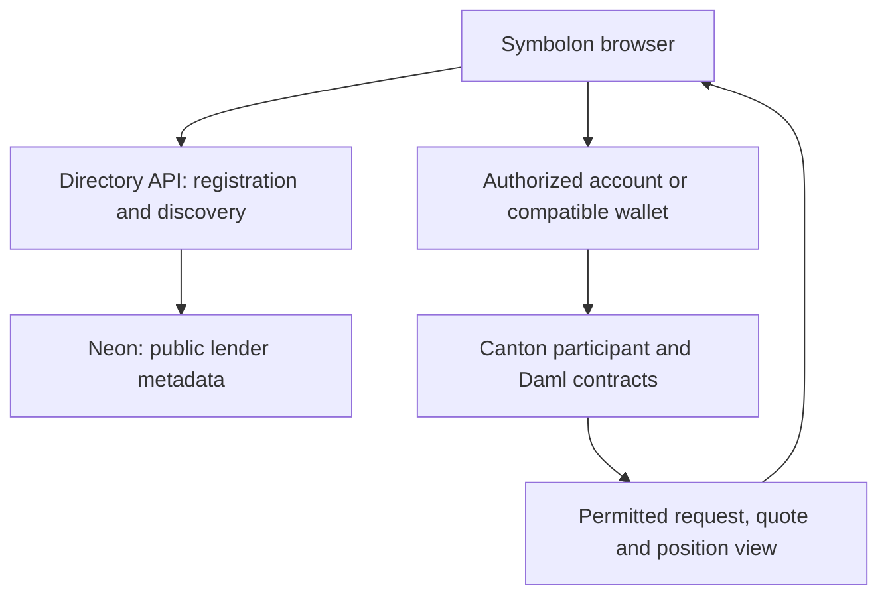

# Overview

Symbolon separates counterparty discovery from financial execution. The directory helps borrowers find registered lenders; Canton contracts authorize requests, offers, settlement and collateral management.

## Three responsibilities

| Layer | Responsibility | What it cannot do by itself |
| --- | --- | --- |
| Browser app | Display permitted records, explain terms and submit the user's chosen action. | Authorize a trade merely by showing an enabled button. |
| Directory API and Neon database | Verify lender registration rights and store public lender names, party IDs and market preferences. | Set APR, reserve cash, settle a repo or read everyone's private positions. |
| Canton/Daml contracts | Enforce counterparties, balances, locks, accepted terms and lifecycle conditions. | Establish that a simulated price represents a real market or that external tokens are supported. |

## Example: registration is not a quote

Blair registers for the cBTC-demo / USDCx-demo market. The directory lists Blair as a possible recipient. Alex approves that audience and submits a separate ledger request to Blair.

Blair's 7% offer is a later authorized ledger action backed by reserved cash. Changing Blair's directory label cannot alter that rate or move funds. Acceptance and repayment remain contract operations.

## Explore the important boundaries

- [Privacy and Visibility](privacy-and-trust.md) compares who receives each type of information.
- [Onchain and Offchain Data](onchain-offchain.md) identifies the authoritative ledger records and offchain stores.
- [Contracts and Permissions](daml.md) explains which party can perform each action.

Implementation and operator runbooks remain in the repository. The current public app uses simulated DevNet assets; real token adapters and independent operator deployment require separate work.
