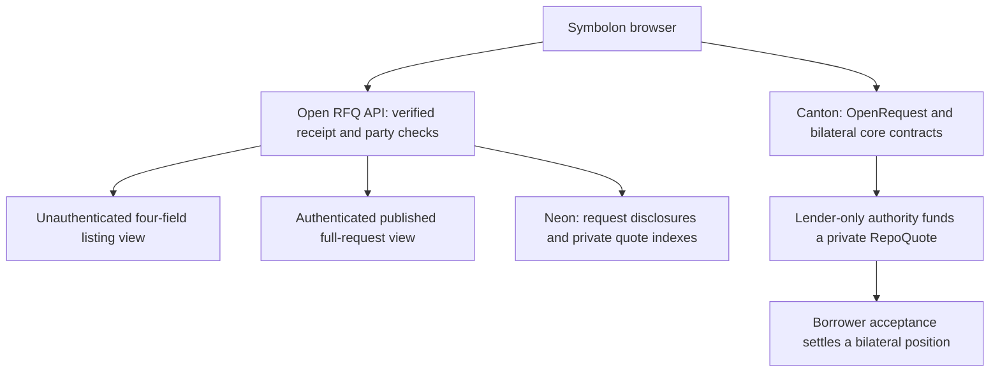

# Overview

Symbolon separates public discovery, borrower-consented request disclosure and bilateral financial execution. Unauthenticated readers get a minimal board. Authenticated connected parties can read a published request and quote directly; private funded quotes and positions remain in their counterparty views.

## Three Responsibilities

| Layer | Responsibility | Important boundary |
| --- | --- | --- |
| Browser app | Review publication consent, display permitted views and submit the user's selected request/quote action. | Hidden fields are not an authorization boundary; party identity and controller rights matter. |
| Open RFQ API and Neon | Verify original ledger publication/quote/withdrawal receipts, serve minimal public and authenticated pricing views, and restrict private quote indexes to counterparties. | Operators can read stored disclosures and quote-index metadata. A database write does not move assets. |
| Canton/Daml | OpenRequest authorizes independently funded quotes; existing core contracts enforce balances, locks, acceptance and lifecycle conditions. | A published disclosure is not a collateral proof, real-token adapter or guarantee of repayment. |

## Example: A Published Request Is Not Settlement

Alex signs and publishes an OpenRequest. Blair reads its full terms after authentication, chooses 7% APR and reserves existing cash through SubmitOpenQuote. Alex can be offline during that quote step. The resulting RepoQuote is bilateral; only Alex's later acceptance exchanges cash and collateral and creates a position.

## Explore the Important Boundaries

- [Privacy and Visibility](privacy-and-trust.md) distinguishes default template roles from explicit published disclosure.
- [Onchain and Offchain Data](onchain-offchain.md) explains the authoritative records, stored disclosures and protected quote index.
- [Contracts and Permissions](daml.md) explains who can publish, quote, withdraw and accept.

The current asset model remains simulated DevNet Holding contracts. Native-token adapters, independent operating arrangements and a new external two-account funding lifecycle are not established by a package upload, a successful API read or these illustrations.
