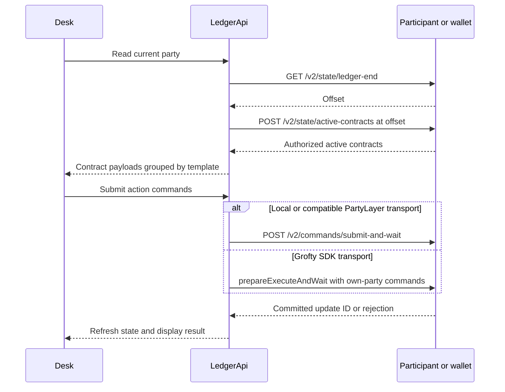

# Frontend and ledger data flow

The frontend uses React, TypeScript and Vite. `web/src/main.tsx` chooses the landing page or desk according to the pathname; `/app` is the desk. The implementation does not require a router framework or server rendering. The static host must still serve the SPA entry point for a direct visit to `/app`.

## One session boundary

The session abstraction supplies the active party, a read operation, a command-submission operation and disconnect behavior. Local demo mode uses a development proxy. The existing wallet path delegates Ledger API requests through PartyLayer. Grofty has a dedicated SDK transport with own-party reads and a separate prepared-transaction operation. Read-only browsing must not silently impersonate a demo trader or show their private contracts.

`restoreSession()` restores an already active wallet session without opening a connection prompt automatically. `sandboxModeEnabled()` requires loopback hosting and development mode or the explicit local-preview flag. In local mode, browsing may use the oracle's public demo marks; an external site remains empty until an authorized wallet is connected. The local role picker is never a substitute for remote party authentication.

Wallet discovery and wallet support are distinct. Discovering an extension or receiving a party ID does not prove that its `ledgerApi` method can read the required contracts or submit these choices on the selected network. The wallet chapter contains the acceptance checklist.

The [Grofty adapter](../guides/grofty.md) binds a session to an allocated primary MainNet party and extension version 2.0.4 or later. It verifies that identity before reads and submissions, invalidates the session on relevant account/status changes, and removes event listeners during cleanup. A restored connection does not trigger a new permission prompt automatically.

## Reading contract state

The client asks for a ledger-end offset, then reads active contracts for the authorized party at that offset. `deskState` classifies contracts by module and template into holdings, feeds, RFQs, quotes, positions, proposals and receipts. This is a projection of the party's view, not a global index of Symbolon trades.

The desk refreshes periodically and after actions. Polling is a prototype mechanism: it is not streaming market data, a durable event journal, or an accounting history service. Closed receipts appear because they remain active contracts; they are not reconstructed from a separate database.

Grofty reads ledger end and active contracts through its restricted SDK surface. Its submission path omits `actAs`/`userId`, accepts only the connected party in `readAs`, and requires a matching executed receipt with a valid update ID and completion offset. It does not forward commands through the read-only `ledgerApi` method. The adapter preserves optional disclosure metadata but does not provide automatic cross-participant disclosure exchange.

## Commands and preparation

`actions.ts` builds JSON `CreateCommand` and `ExerciseCommand` values. Asset-consuming operations first prepare exact-sized unlocked holdings, merging and splitting privately where necessary. Those preparation commands can commit separately before the final repo action. The final Daml choice still atomically performs its own cash/collateral changes. Passing an oversized input into a bilateral choice would expose its source amount/change to witnesses, so the contract explicitly rejects it.

All operations need fresh contract IDs. A changed feed or position archives its previous version. A stale form may therefore fail correctly even when the user had enough balance when they first opened it. Show the rejection, refresh, and require the user to review changed economics before trying again.

## Display arithmetic

JavaScript numbers are convenient for labels, charts and input previews. They must not become a second authoritative financial engine. Ledger Decimal strings and integer strings are the transport representation. Compare the displayed calculation with the Daml formula, and do not round a submitted payoff below the stored repurchase price.

Balances must retain issuer identity and distinguish free from locked holdings. Price selection must use the agreed oracle and asset pair rather than the first feed sharing a symbol. These rules prevent a plausible UI from displaying an amount that the ledger will correctly refuse to spend.

## Data handling

Do not put participant credentials into `VITE_` variables: those values are embedded in the public bundle. Persisting a remembered party or wallet choice is not a substitute for authentication. Inspect browser storage and network behavior as part of deployment review, and keep ledger payloads out of unnecessary analytics and error-reporting integrations.

## Controls available in the desk

The RFQ form supports manually supplied dealer party IDs, issuer/oracle selection, editable 1–365 day tenor, 100–200% required coverage, a 1-minute to 7-day cure window and a 1-minute to 24-hour mark-age window. Quote controls allow 0–100% annualized simple rate and 1-minute to 24-hour validity. These UI limits are narrower than some contract bounds; the contract remains the authority.

Balances separate free and locked holdings. Quote revocation and proposal withdrawal release their respective reservations. The interface reports pending commands, confirmed update IDs and failures. This makes it possible to distinguish an accepted form input from a ledger action that actually committed.
