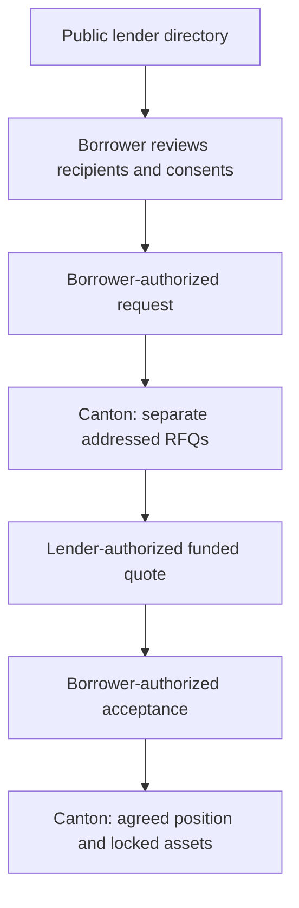

# Onchain and Offchain Data

Canton contracts hold the authoritative financial state. The directory and browser store different information for discovery and presentation. A database update does not authorize a cash transfer.

## On the Canton ledger

| Record | What it stores | Practical example |
| --- | --- | --- |
| Holding | Issuer, owner, instrument, amount and locks. | Blair's exact 1,000 cash slice is reserved for a quote. |
| QuoteRequest | Counterparties, amount, term and proposed collateral terms. | Alex's request addressed to Blair. |
| RepoQuote | APR, expiry, terms and reserved funding. | Blair's 7% funded offer. |
| RepoPosition | Agreed repayment, maturity, pledged collateral and margin state. | The accepted Alex/Blair agreement. |
| PriceFeed | Oracle, asset identities, mark, timestamp and readers. | A simulated 60,000 mark for the chosen issuer pair. |
| ClosedRepo | The recorded closing outcome and agreed amounts. | Repurchased after the full contractual amount is paid. |

## Off the ledger

| Store | Information | Audience and limit |
| --- | --- | --- |
| Neon `symbolon_lenders` table | Lender name, party, market preference and active registration. | Public discovery metadata; no private trade or balance data. |
| Browser memory | Authorized ledger projection, forms and pending feedback. | Current session; the participant remains authoritative. |
| Tab-scoped browser storage | Bounded connection preferences and draft inputs. | Cannot restore signing authority or submit a recovered draft. Tokens are not stored there. |
| Public deployment configuration | Reviewed network, packages and public test-market identities. | Describes the deployment; does not grant account rights. |
| Downloaded receipt | A confirmed action's correlated record. | User export; not a global transaction index. |

## Example: the path of one request

Alex reads Blair's public registration from the directory. Alex approves the recipient list, then submits a QuoteRequest to Canton. The request amount and collateral stay in the entitled ledger view; they are not copied into the directory table.

There is no durable global index of every Symbolon trade. Active-contract reads and visible closure records are scoped to authorized parties. The dedicated BitSafe LocalNet environment has its own governed price-publication records; it is separate from the public single-operator reference market.
