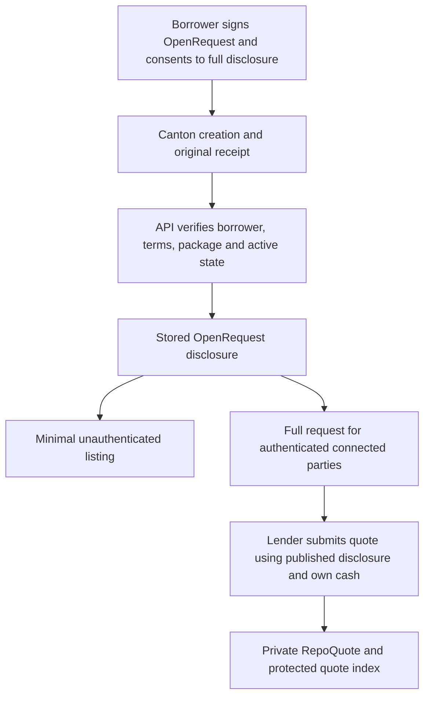

# Onchain and Offchain Data

Canton holds authoritative financial contracts. The Open RFQ service verifies ledger receipts and stores a disclosure/index for discovery. Publishing a database row cannot replace a valid ledger creation, cash reservation or withdrawal.

## On the Canton Ledger

| Record | What it stores | Example |
| --- | --- | --- |
| OpenRequest | Borrower identity and immutable financing terms, signed once without choosing a lender. | Alex's 1,000, 30-day request, intentionally disclosed by publication. |
| Holding | Issuer, owner, instrument, amount, viewers and locks. | Blair's exact existing cash is reserved for a quote. |
| QuoteRequest | Bilateral proposed terms. | A transient core request created and consumed inside SubmitOpenQuote. |
| RepoQuote | Private APR, expiry, terms and reserved cash. | Blair's funded 7% offer. |
| RepoPosition | Agreed repayment, maturity, pledged collateral and margin state. | The accepted Alex–Blair agreement. |
| PriceFeed | Oracle, asset identities, mark, time and readers. | The agreed simulated reference used for health/acceptance. |
| SubstitutionProposal / ClosedRepo | Bilateral replacement proposal / closing outcome. | Lender-approved replacement or confirmed Repurchased closure. |

## Off the Ledger

| Store or response | Information | Audience and limit |
| --- | --- | --- |
| Minimal board DTO | Random listing ID, supported market/pair, open state and date. | Web-readable without login; no borrower identity or financing amounts. |
| Authenticated pricing view | Borrower party ID and full published request terms. | All authenticated connected Symbolon parties after the borrower's one publication consent. It contains no competing quote APRs. |
| Neon `symbolon_open_requests` | Terms, borrower, market, verified OpenRequest ID/template/disclosure blob and publication/closure receipts. | The API validates the original ledger event and current lifecycle. Operators can read stored disclosures. |
| Neon `symbolon_open_quotes` | Request link, quoting party, rate, expiry, quote ID and receipt. | Counterparty-filtered application views; database operators can read the index. It is not part of the public pricing board. |
| Legacy directory/access records | Earlier registrations and individually approved discovery records. | Original audiences remain; no automatic republication into Open RFQ. |
| Browser memory, tab drafts and retained receipt IDs | Authorized projection, user input and recovery identifiers. | Tokens/disclosure blobs are not retained in receipt recovery storage; a draft cannot grant authority or submit itself. |

## Example: Verify Before Indexing

Alex creates the OpenRequest on Canton, then publishes its confirmed receipt. The API checks the template/package, borrower, exact terms, synchronizer and active contract before storing a new disclosure. Blair quotes with its own available cash; a later receipt links only the actual private quote and reserved funding to that request.

A failed synchronization is reconciled using the original receipt, not by repeating a financial submission. Withdrawal stops new quotes but cannot erase previously disclosed terms. The dedicated BitSafe LocalNet price-governance records and retained financial lifecycle evidence remain separate from Open RFQ publication/API checks.
