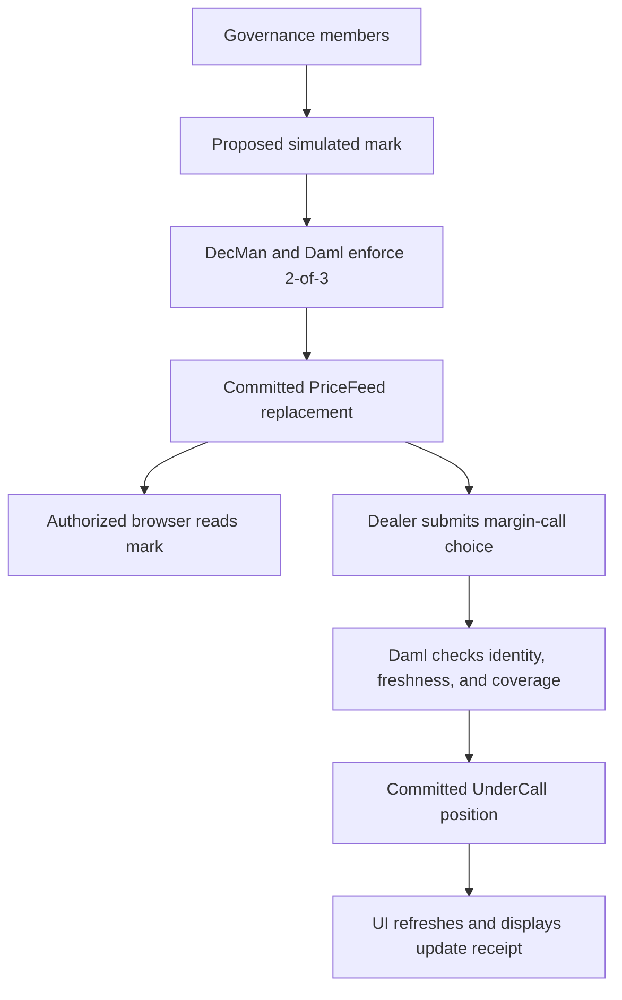

# Onchain and Offchain Data

Canton contracts are the authority for Symbolon's financing state. The browser reads a party's permitted contracts and builds a temporary view for display. Editing a form changes no asset balance or repo until a command commits.

## Authoritative ledger state

| Contract | Stored data | Authority |
| --- | --- | --- |
| Holding | Issuer, owner, instrument, quantity, viewers, and locks | Issuer and permitted owner/lock controllers |
| QuoteRequest | Counterparties, amounts, term, and proposed risk parameters | Borrower; addressed dealer observes |
| RepoQuote | Fixed rate, expiry, terms, and reserved cash | Joint signatories and permitted choices |
| RepoPosition | Repurchase amount, maturity, collateral references, oracle, and margin state | Borrower/dealer contract authority |
| PriceFeed | Pair identity, oracle, value, timestamp, and readers | Named oracle; governed publication in the BitSafe path |
| SubstitutionProposal | Reserved replacement collateral and approval context | Proposal borrower/dealer authority |
| ClosedRepo | Outcome, amounts, collateral identity, and closing time | Authorized closing choice |
| BitSafe governance contracts | Member set, rules, proposals, and execution | Configured decentralized-party governance |

## Offchain application records

| Location | Purpose | Persistence and limits |
| --- | --- | --- |
| React state | Forms, selected market, contract projection, and action feedback | Browser memory; refresh reads the ledger |
| /deployment.json | Network profile, reviewed package, and public asset identities | Public configuration; no participant credentials |
| Wallet session | Party identity and read/submit transport | Session boundary; connection does not create rights |
| Local setup files | Seeded party mapping and verification logs | Ignored development files under .omc/demo |
| BitSafe evidence | Update IDs, offsets, threshold rejection, closure, and audits | Run output; public evidence is a curated copy |

The current app has no Symbolon-operated business database or global transaction index. Active-contract polling is a scoped projection, not a durable accounting archive. An indexer or audit export requires separate implementation and permissions.

## From a proposed price to a ledger effect

A governed mark is a controlled input, not proof of economic accuracy. The margin choice checks the feed and position independently. Stale IDs, wrong issuer/oracle, or invalid marks cause rejection even when a preview looks acceptable.
