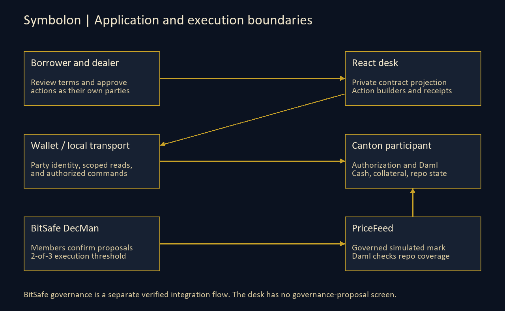
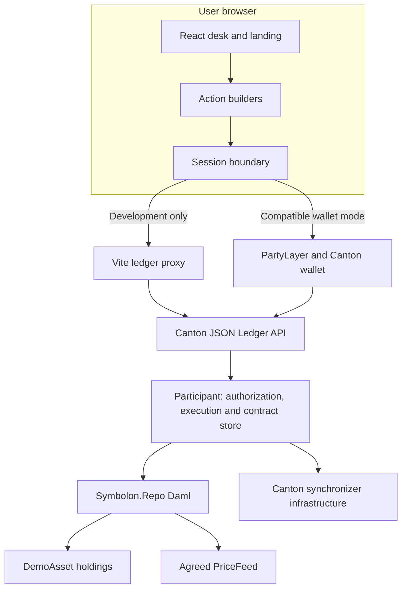

# Technical Architecture

Symbolon has two principal implementation layers: Daml contracts that enforce the transaction and a React browser application that presents and submits it. The current application has no Symbolon-operated database, order matcher or business-logic API. Canton participants and wallets remain essential infrastructure; the absence of a custom application backend does not remove infrastructure trust.

## Component ownership

| Component | Responsibility | Source location |
| --- | --- | --- |
| Repo model | Quote, settlement, position and closing transitions | `daml/Symbolon/Repo.daml` |
| Demo assets | Transferable test holdings and restrictions | `daml/Symbolon/DemoAsset.daml` |
| Script tests | Deterministic and adversarial assertions | `daml-test/Symbolon/Test/EndToEnd.daml` |
| Live setup/scripts | Seed and exercise a wall-clock sandbox | `daml-live/Symbolon/` |
| Ledger transport | HTTP or wallet requests and command encoding | `web/src/ledger/api.ts` |
| Session model | Current party, wallet connection and local mode | `web/src/ledger/session.ts` |
| Contract projection | Typed payloads, contract buckets and display calculations | `web/src/ledger/symbolon.ts` |
| Actions | Assemble authorized choices from current state | `web/src/app/actions.ts` |
| Desk UI | Forms, balances, positions, errors and oracle controls | `web/src/app/DeskApp.tsx` |

## Why the boundary matters

The UI can calculate an estimated repurchase amount and determine whether a button appears useful. It cannot authorize an invalid trade. Daml checks still run when a client bypasses the UI, changes a payload, retries a stale command or references a different asset.

Conversely, correct contracts do not automatically produce a safe deployment. An unrestricted local Ledger API is suitable only for a controlled demo. Production authentication, party rights, wallet behavior, token adapters, operator access and monitoring require separate work.

## Deployment shapes

**Local development:** one sandbox may host borrower, dealers, oracle and issuer. The browser accesses it through a local proxy, and developers may switch demo roles. This is a convenient test environment, not independent institutional hosting.

**Wallet access:** the browser connects through the PartyLayer path to a compatible Canton wallet. The party, packages, assets, synchronizer, and supported wallet API must match the configured network. A connection alone does not prove settlement. The prototype Grofty adapter remains in source for later work and is outside the current submission scope.

**Future multi-operator pilot:** counterparties use appropriately isolated participant infrastructure and real authorized assets. The transaction model can be tested in that topology, but the current repository does not claim such a deployment has been completed. See [DevNet readiness](../guides/wallet-devnet.md).

## Ledger and application data

[Onchain and Offchain Data](onchain-offchain.md) distinguishes authoritative contracts, browser memory, public runtime configuration, and recorded execution evidence. The current app has no custom business database or durable global index.

## Governed oracle publication

BitSafe DecMan uses the configured 2-of-3 rule to execute a Symbolon price-mark proposal. The replacement feed changes repo coverage; the dealer's margin choice validates that feed independently. The [LocalNet integration](../guides/bitsafe-localnet.md) records below-threshold rejection, successful execution, and repo repurchase. Governance proposals run through the integration harness, not a screen in the current desk.
