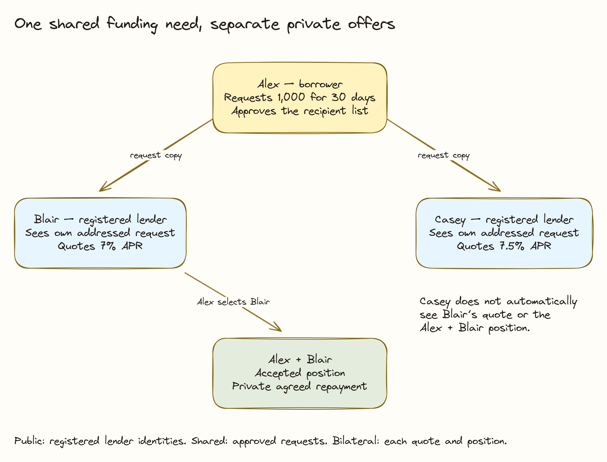

# Privacy and Visibility

Reading a contract and being allowed to act on it are different permissions. Symbolon uses both the ledger's visibility rules and the signing party's authority.

## Direct audiences compared

| Record or action | Borrower | Addressed lender | Other lender | Public directory reader |
| --- | --- | --- | --- | --- |
| Lender registration metadata | Can read | Can read | Can read | Can read |
| Request sent to Blair | Can read | Blair can read | Receives only its own separately addressed request if included | No automatic access |
| Blair's funded quote | Can read | Blair can read | No automatic access | No automatic access |
| Winning position with Blair | Can read | Blair can read | No automatic access | No automatic access |
| Position management and closure | Can read relevant results | Winning lender can read relevant results | No automatic access solely from being asked to quote | No automatic access |

The table describes direct application and contract audiences. It is not a promise that entitled transaction witnesses or infrastructure operators can never learn a related field.

## Example: who sees 7%?

Alex approves sharing a 1,000 request with Blair and Casey. Both see the funding need through their separate requests. Blair quotes 7%; Casey quotes 7.5%. Alex sees both. Casey does not automatically receive Blair's 7% quote or the settled position after Alex chooses Blair.

## Who can act?

| Permission | Example |
| --- | --- |
| Directory reader | Can discover Blair's published party ID; cannot sign as Blair. |
| CanActAs for a party | Can register that party and submit its permitted choices. |
| Request's addressed lender | Can price that request using its own compatible cash. |
| Borrower of a quote | Can accept or reject that offer under the contract checks. |
| Agreed oracle | Can publish its own price feed; being a lender alone does not grant this authority. |

## Remaining trust boundaries

The directory operator can see the registration metadata stored in Neon. It does not store financing requests, quote APRs, balances or positions. Account tokens are checked against the pinned participant and are not persisted in the directory.

Asset issuers can see entitled asset effects, and hosting operators remain a dependency. The demo's roles share an operator. Party-specific views therefore do not prove infrastructure isolation between independent institutions or anonymity.
