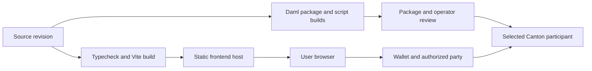

# Deployment and operations

## Two deployable artifacts

The frontend build produces static files under `web/dist`. The Daml build produces a DAR package under each package's `.daml/dist` directory. Hosting the frontend does not upload those packages to a participant or supply a wallet party with assets.

## Frontend hosting

Run `npm ci` and `npm run build` from `web`. Serve the resulting static directory with a fallback to `index.html` for `/app`. Test a direct page load and refresh on `/app`, not only navigation from the landing page.

The Vite development proxy is not included in the production build. A deployed direct-HTTP mode therefore needs an explicitly reachable, correctly authenticated and CORS-compatible endpoint. The production target should normally use the verified wallet path rather than expose a development sandbox to the internet.

Review public environment variables before building. No seed credentials, participant administration tokens or wallet secrets belong in the bundle, repository, browser console or submitted demo recording.

## Daml packages

Build the core model before the test and live-script packages because they depend on its DAR. Retain the exact source revision, package names/versions and resulting package IDs in the deployment record. Name-based identifiers such as `#symbolon:Symbolon.Repo:RepoPosition` simplify the client, but do not by themselves establish compatibility across changed schemas or eliminate package upgrade review.

For a new participant, follow its operator's package upload and vetting process. Do not assume local party allocation, administrator endpoints or permissive local authorization are available on a shared DevNet.

## Runtime operations

The local demo can be restarted and reseeded, but a persistent deployment cannot treat contract state as disposable. Consuming choices produce new contract IDs. Backups, package upgrades and recovery need the participant operator's procedures, plus a plan for active positions and outstanding quotes.

Monitor command failures, network availability and oracle freshness. Logs should retain enough diagnostic information to resolve failures without unnecessarily collecting private terms. The prototype does not include a production alerting service, data-retention policy, disaster-recovery test or service-level commitment.

## Minimum release record

Record the source revision, Daml SDK and runtime versions, test output, frontend build result, environment settings without secrets, deployed package IDs, network topology, supported wallet versions, known limitations and rollback approach. A static website URL is useful evidence of hosting; it is not evidence of successful repo settlement.
