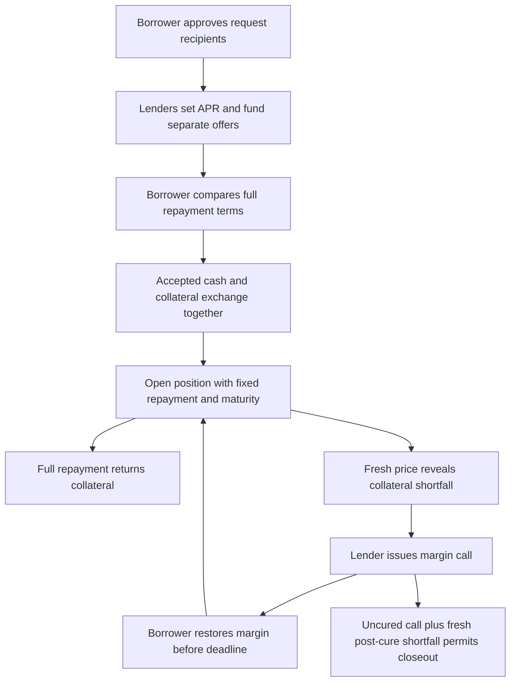

# Overview

Symbolon follows a request → offer → settlement → repayment workflow. The borrower chooses the cash amount and duration; lenders independently price the request. Acceptance fixes the contractual repayment and opens the position.

## Example: one agreement from start to finish

Alex requests 1,000 USDCx-demo for 30 days, pledging 0.0250 cBTC-demo at a simulated mark of 60,000. Blair quotes 7% APR. After Alex accepts, the cash goes to Alex and the pledged collateral transfers to Blair under restrictions. The full repayment is approximately 1,005.83, with the exact amount shown before acceptance.

If Alex repays on time, Blair receives the agreed cash and Alex recovers the collateral. If coverage falls during the term, Alex may need to restore margin before the applicable deadline. Fixed repayment and changing collateral value are separate parts of the agreement.

## Follow each stage

| Stage | What the reader learns |
| --- | --- |
| [Requests and Offers](quotes.md) | Who receives a request, how lenders price it, and why funding is reserved. |
| [Settlement and Repayment](settlement.md) | What moves at acceptance and what amount returns at repayment. |
| [Collateral and Health](collateral.md) | How coverage changes, when a margin call can occur and how to respond. |
| [Position Lifecycle](lifecycle.md) | What Active, UnderCall and the closing outcomes mean. |

Terms run from 1 to 365 whole days after settlement. The examples use 30 days to make the calculation easy to follow.
