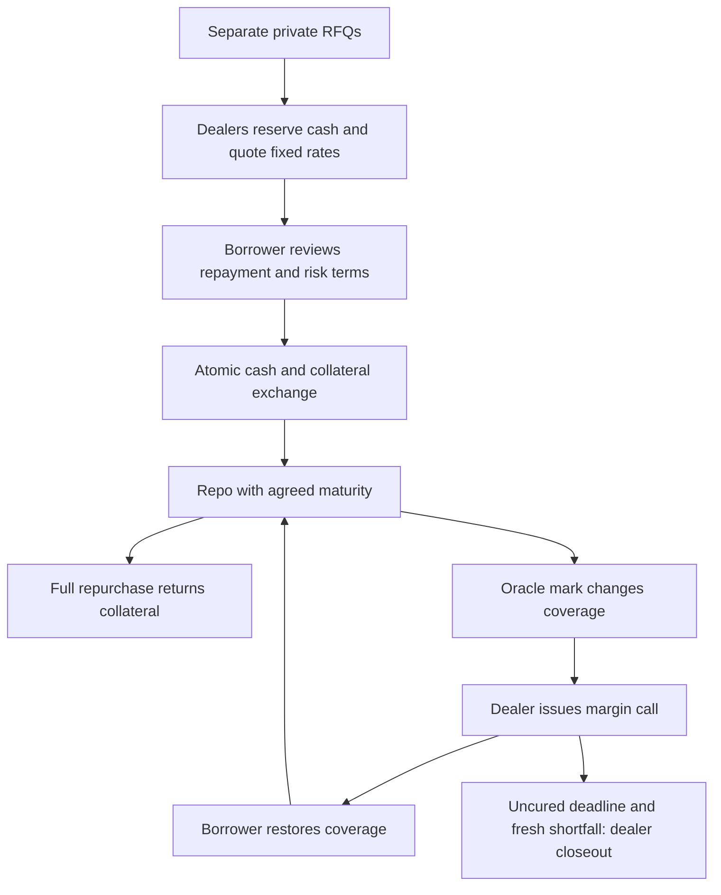

# How Symbolon Works

The borrower and dealer agree a private financing deal, settle it on Canton, and manage its collateral until closure. The annualized rate and full repurchase amount are fixed when the quote is accepted. Collateral value can change during the term.

## Follow the stages

1. [Private requests and quotes](quotes.md) explains offer visibility and dealer cash reservations.
2. [Settlement and repurchase](settlement.md) explains atomic movements and repayment arithmetic.
3. [Health factor, margin, and liquidation](collateral.md) explains price changes, cure windows, and closeout.
4. [Repo lifecycle](lifecycle.md) maps ledger states and closing outcomes.

The current contract accepts whole-day terms from 1 to 365 days. A 30-day example illustrates the calculation; fixed-rate financing is the product's focus.
