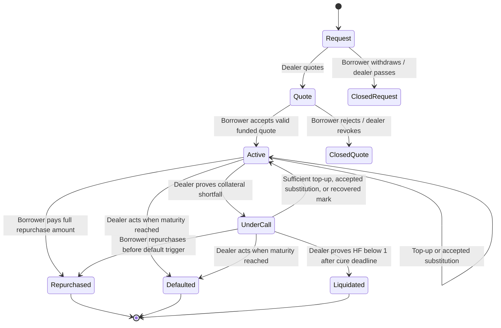

# Repo lifecycle

The ledger represents a trade as a succession of contracts. Most choices consume the current contract and create its next state. Contract IDs therefore change after a quote is consumed, a margin call is raised, a position is cured, or collateral is substituted. A client must refresh its view after a committed action.

## Before settlement

An RFQ specifies the proposed cash and collateral identities, quantities, term and risk parameters. A quote adds the dealer's rate and expiry. These are offers in the workflow; they are not active financing positions. Accepting a quote is the event that moves assets and establishes maturity from ledger time.

Requests to different dealers remain independent. Accepting one quote does not automatically cancel all other requests or quotes. The borrower should clean up remaining offers; the demo does not assume that the ledger knows the borrower's intent across separate RFQs.

## During the term

The position is either `Active` or `UnderCall deadline`. An active position may still have health factor below `1.00` before a dealer submits a margin call. The UI's factor is informative; the Daml choice independently validates the referenced oracle feed when a party acts. A borrower can clear an open call after a recovered mark is validated, before maturity.

Top-up and substitution replace the position with a new active contract if the resulting collateral satisfies the required value. Rate, purchase price and original maturity remain unchanged.

## Ending the trade

Repurchase exchanges the full agreed cash amount for all pledged collateral and creates a `ClosedRepo` with outcome `Repurchased`. After an uncured deadline, a dealer can exercise `Liquidate` only while a fresh mark still proves health factor below `1.00`. At maturity the dealer can separately declare default. Both closeouts give the dealer the pledged demo collateral; neither timer alone sends a command.

The implemented time boundaries and permitted actions are documented in [health factor and liquidation](collateral.md). A closed receipt is evidence of the ledger outcome, not proof that external legal obligations have been discharged or that collateral has been sold.
