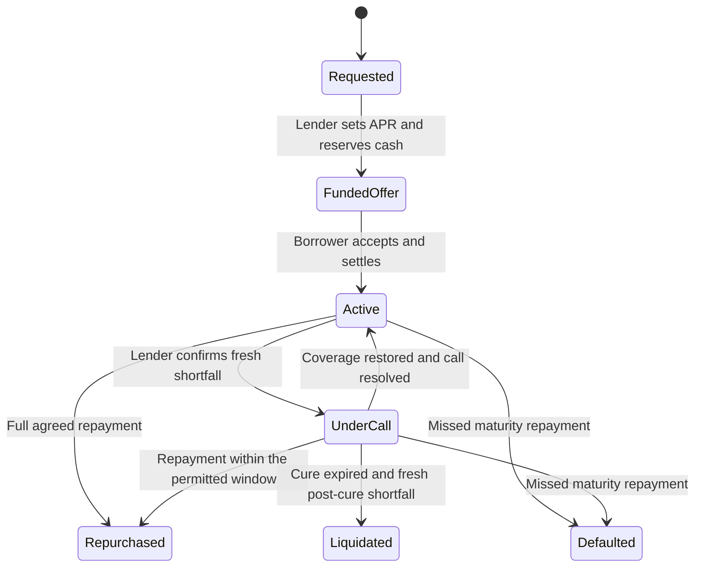

# Position Lifecycle

A position's state explains what happened and which action can follow. A submitted command, an open quote and a settled position are different stages.

## Example: a successful repayment

Alex sends a request; Blair creates a 7% offer; Alex accepts it. The position is Active. Alex pays the full agreed cash within the allowed window, collateral returns, and Activity records Repurchased.

## Closing outcomes compared

| Outcome | What happened | What it does not imply |
| --- | --- | --- |
| Repurchased | Full agreed repayment and collateral return committed. | A floating interest rebate. |
| Liquidated | A permitted post-cure shortfall closeout released pledged collateral to the lender. | A collateral auction or realized sale proceeds. |
| Defaulted | A permitted maturity-default closeout released pledged collateral to the lender. | That the cash repayment was received. |

**Example:** Activity showing Defaulted must not be interpreted as Blair receiving principal plus interest. The recorded outcome and collateral movement differ from Repurchased.

During any stage, an uncertain submission stays unresolved until its original receipt or failure is reconciled. Refreshing a page or dismissing a notification is not proof that a transaction committed.
