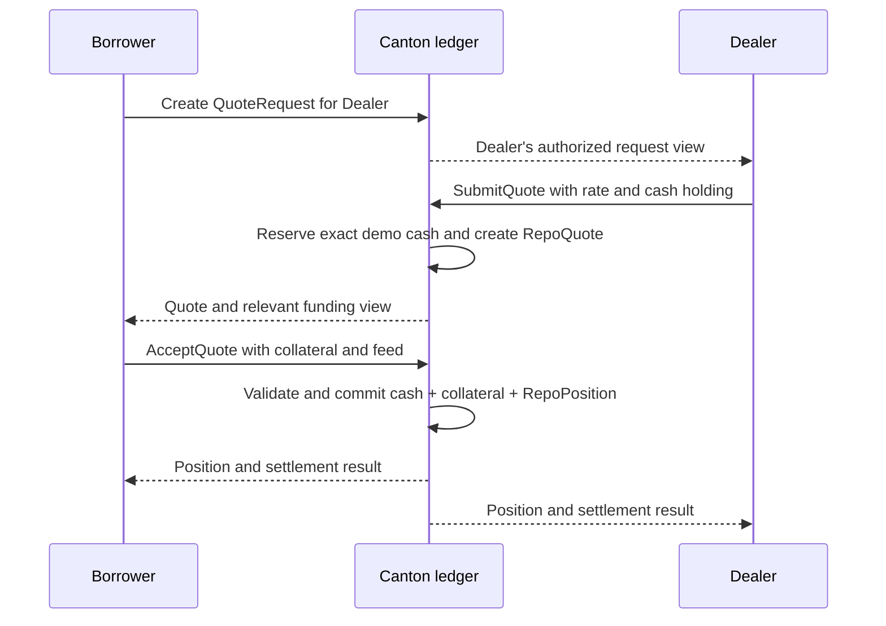

# Private requests and quotes

An RFQ expresses proposed terms before a repo exists. The borrower creates one `QuoteRequest` for each selected dealer. The records share economic terms but have separate counterparties and contract IDs. A dealer does not need to know whom else the borrower approached.

## Request terms

The request identifies the borrower, dealer and agreed oracle; the collateral issuer/instrument and quantity; the cash issuer/instrument and amount; the term in days; the required coverage ratio; the margin cure duration; and the maximum accepted price age. The issuer is part of an asset's identity. Two tokens called CUSD from different issuers are not interchangeable.

These terms should be reviewed before the request is submitted. A short demo cure window is useful for observing health-factor liquidation, but should never be presented as a researched production risk setting.

## Dealer response

The dealer supplies an annualized rate, a quote-validity duration, and a suitable cash holding. The quote operation reserves the exact required cash under the contract's lock mechanism. The remaining dealer cash is separate from the reserved slice. Funding does not become spendable by a borrower simply because the borrower can observe it.

A quote creates a potential commitment and ties up the reserved demo amount until settlement or an explicit release action. Neither an expired UI countdown nor a page refresh should be interpreted as an automatic release. The API reference lists the available quote choices.

## Acceptance

The borrower supplies the collateral holding and a valid agreed price feed. The contract checks expiry, instrument identities, available amounts, feed freshness and initial coverage, then moves both asset legs in one transaction. If any check fails, no partial repo settlement commits.

## Race conditions and separate requests

Quotes are ledger contracts, so concurrent acceptance, rejection or revocation can consume the same input. One command can succeed while another finds the contract inactive. The client must refresh and show the actual outcome instead of resubmitting a guessed equivalent command.

Accepting a quote does not make other offers disappear. Reject or revoke unused quotes so their funding can be released. Quote cleanup is operational work; there is no central matching service managing the borrower's entire shortlist.
