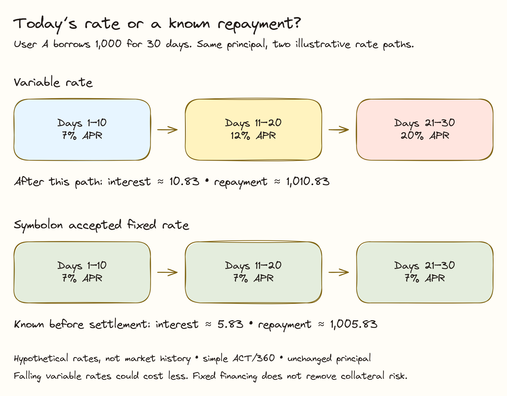

# Why Fixed Rate?

You should be able to answer a simple question before borrowing: **how much cash will I need to repay this agreement?** Symbolon makes that amount explicit before settlement.

## The Problem with Variable Rates

In variable-rate lending, the rate shown when you borrow may change while the position remains open. Aave, for example, adjusts borrowing rates using utilization and governance parameters. Interest therefore depends on what happens after entry. See [Aave's borrowing guide](https://aave.com/help/borrowing/borrow-tokens).

For a borrower, a higher rate can consume more of the cash reserved for repayment. For a lender, a lower rate can reduce the interest expected from keeping capital supplied. Neither change needs to match the user's original plan.


**The planning gap:** knowing today's APR is different from knowing the interest expense for the full term.


## A Public Example of Rate Changes

Galaxy Research reported that onchain stablecoin borrowing rates rose above **15% during the March 2024 market upswing**, while the OTC rates it described were around 7–10%. Its onchain series combines USDC and USDT borrowing on Aave V2/V3 and Compound V2/V3 on Ethereum mainnet, using weekly volume-weighted rates.


**Historical context, not today's quote:** above 15% describes an annualized rate level in that report. It does not mean a 15% daily increase, a guaranteed future spike, or a measured outcome from Symbolon.


The finding gives a concrete example of the planning problem: market conditions can change the cost of floating financing while the borrower still needs the cash. It does not show that every borrower experienced a budget disruption or would choose fixed terms.

Source: [Galaxy Research, *The State of Crypto Lending*, April 2025, pp. 22–23](https://assets.ctfassets.net/h62aj7eo1csj/4vkA9567QmK4pyYoPBtrQa/fb039fd97d657d8151dcf4d3e969e481/The_State_of_Crypto_Lending_-_Galaxy_Research.pdf).

## Example: Same Borrowing Need, Different Budget

User A needs **1,000 USDCx-demo for 30 days**. Compare a fixed 7% agreement with a hypothetical changing rate. This is a simple-interest illustration on an unchanged principal, not historical Aave data or a forecast.

| Period | Hypothetical variable APR | Symbolon accepted APR |
| --- | --- | --- |
| Days 1–10 | 7% | 7% |
| Days 11–20 | 12% | 7% |
| Days 21–30 | 20% | 7% |
| Approximate term interest | 10.83 USDCx-demo | 5.83 USDCx-demo |
| Approximate total repayment | 1,010.83 USDCx-demo | 1,005.83 USDCx-demo |

For the fixed agreement, **1,000 × 7% × 30 / 360 ≈ 5.83**. The variable example adds each ten-day period at its illustrative rate. Actual floating products may use different accrual and compounding rules.


**With Symbolon:** User A can reserve the contractual repayment before settlement. A later 12% or 20% market quote does not change A's accepted 7% terms.


If variable rates fell instead, variable borrowing could cost less. Fixed financing offers budget certainty; it does not promise the cheapest outcome.

## What This Means for Borrowers and Lenders



### For Borrowers

Agree the cash amount, duration and full repayment before committing collateral. Plan the payment date around your cash needs.

**Example:** A accepts about 1,005.83 repayment for 30 days and knows how much compatible cash to prepare.


### For Lenders

Choose the annualized rate for your own funded offer. If accepted, the contractual principal-plus-interest amount is fixed.

**Example:** B funds 1,000 and agrees about 5.83 interest. Receiving it still depends on repayment or the closeout outcome.



## Why Repayment Certainty Matters to a Treasury Team

Cash planning

Schedule the agreed repayment alongside operating expenses and other obligations. A 30-day agreement due for approximately 1,005.83 gives a concrete cash target; the exact review amount is authoritative.

Comparing offers

Compare the full cost for the same principal and term, then check collateral, oracle, deadlines and counterparty terms. At 1,000 for 30 days, 7% APR means approximately 5.83 interest while 7.5% means 6.25. The lower APR alone is not the whole decision.

Keeping an internal record

The agreement records the accepted rate, duration, maturity and exact repayment. These give a consistent reference when explaining the quote choice and preparing cash. This does not by itself establish regulatory compliance or satisfy an audit.

## Fixed Rate Does Not Remove Collateral Risk

Rate certainty and collateral health answer different questions. In Aave, health depends on collateral value, liquidation thresholds and borrowed debt; it can deteriorate as collateral falls or debt increases. See [Aave's health-factor explanation](https://aave.com/help/borrowing/liquidations).

In Symbolon, repayment remains fixed while the collateral mark can change. A fresh mark showing insufficient maintenance cover can permit a margin call. An uncured call, an expired cure window and a fresh post-cure shortfall can permit liquidation. Missing maturity is a separate closeout path.


**Keep a collateral buffer.** A fixed repayment does not freeze collateral value or remove top-up and maturity obligations. Full agreed interest remains due if you repay early.


**Example:** 0.0250 cBTC-demo at 60,000 is worth 1,500. Against 1,050 required maintenance cover, health is about 1.43. At 36,000, value falls to 900 and health to about 0.86—even though repayment has not changed.

## What We Have Heard So Far

One informal borrower conversation supports the direction: the person described borrowing USDC on Aave against ETH at around 60% LTV, closing after roughly two months, and worrying that rising rates could increase debt and weaken health. They also valued confidentiality of bilateral financing terms.

This is an early problem signal, not a survey result or proof of adoption. Actual budget disruption, institutional customer fit, switching intent, willingness to pay and pilot participation remain unvalidated. See [User Validation and Pilot Plan](../mission/validation.md).

## How Symbolon Makes Repayment Predictable



### Request an amount and duration

Choose the collateral market, cash amount and term. Approve sharing with eligible registered lenders.


### Compare independently priced offers

Each lender sets its APR and reserves compatible cash. Review total repayment and collateral terms before choosing.


### Accept fixed terms, then manage the position

Acceptance fixes repayment and settles cash against collateral. Monitor health and prepare full repayment before maturity.



## Fixed and Variable Financing Compared

| Question | Variable-rate borrowing | Symbolon fixed agreement |
| --- | --- | --- |
| Does the rate stay the same? | It can change under the rate model. | The accepted annualized rate stays fixed. |
| Can I know term interest before entry? | It depends on subsequent rates and accounting. | Contractual interest is agreed before settlement. |
| Is fixed financing always cheaper? | Falling rates may reduce cost. | No; the quote may include a premium. |
| Can collateral lose value? | Yes. | Yes. |
| Does early repayment reduce interest? | Depends on the product. | Full agreed repayment remains due. |
| Do I still need to monitor? | Yes. | Yes: health, price freshness and maturity. |

Ready to try the workflow? Begin with [Getting Started](../guides/public-devnet.md), then choose [Borrowers](../guides/borrower.md) or [Lenders](../guides/dealer-oracle.md).
