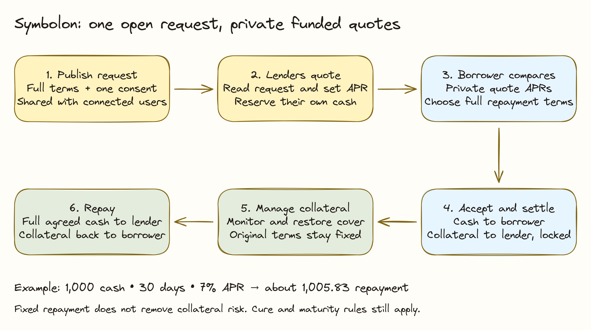

# Overview

Symbolon connects borrowers who need cash with lenders who can finance their collateral. The borrower compares fixed-rate offers, chooses a lender, and knows the contractual repayment amount before the trade settles on Canton.

The current app uses simulated **cBTC-demo** collateral and **USDCx-demo** cash on HackCanton DevNet. These are test assets. Production cBTC and USDCx adapters remain planned work.

## The financing journey

1. A borrower requests an amount and duration from all registered lenders for the selected market.
2. Each lender sets its own annualized rate and sends a funded offer.
3. The borrower compares offers and accepts one. Cash and pledged collateral exchange together.
4. The borrower manages collateral health, then pays the agreed amount to recover the collateral.

## Example: comparing two lenders

Alex requests **1,000 USDCx-demo for 30 days**, pledging **0.0250 cBTC-demo** at a simulated price of **60,000 USDCx-demo per cBTC-demo**. Blair offers **7% APR**; Casey offers **7.5% APR**.

| Offer | Fixed term interest, approximately | Total repayment, approximately |
| --- | --- | --- |
| Blair: 7% APR | 5.83 USDCx-demo | 1,005.83 USDCx-demo |
| Casey: 7.5% APR | 6.25 USDCx-demo | 1,006.25 USDCx-demo |

The examples use simple ACT/360 interest. The review dialog shows the ledger's exact amount before acceptance. Alex can choose Blair's cheaper offer if its other terms are suitable. Casey cannot automatically inspect Blair's quote.

## What becomes predictable?

The accepted rate, duration and principal-plus-interest repayment stay fixed. Collateral prices can still fall, and a margin call can require additional collateral. Fixed financing solves rate uncertainty; it does not remove collateral risk.

Start with [Getting Started](../guides/public-devnet.md), then follow the [Borrowers](../guides/borrower.md) or [Lenders](../guides/dealer-oracle.md) guide.
