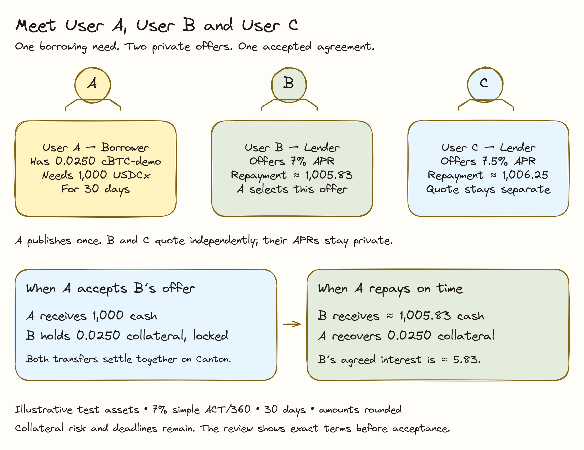

# Overview

Symbolon connects borrowers who need cash with lenders who can finance their collateral. The borrower compares fixed-rate offers, chooses a lender, and knows the contractual repayment amount before the trade settles on Canton.

*Illustrative borrower/lender workflow; simulated demo assets.*

**Read the overview:** User A brings collateral and needs cash. A publishes the full request once with disclosure consent. Connected B and C read it and set their APRs directly. A selects B's suitable offer, receives cash and later repays the agreed amount to recover the collateral. B receives principal plus interest if A repays.

The current app uses simulated **cBTC-demo** collateral and **USDCx** cash on HackCanton DevNet. These are test assets. Production cBTC and USDCx adapters remain planned work.

## The financing journey

1. A borrower signs and publishes one open request, consenting to share its identity and full terms with authenticated connected Symbolon parties.
2. Lenders read the request, choose APRs and fund their own private quotes without registration or per-lender access approval.
3. The borrower privately compares full repayment and collateral terms.
4. The borrower accepts one offer, manages collateral health and pays the agreed amount to recover collateral.

## Example: User A, User B and User C

**User A (Alex)** requests **1,000 USDCx for 30 days**, pledging **0.0250 cBTC-demo** at a simulated price of **60,000 USDCx per cBTC-demo**. **User B (Blair)** offers **7% APR**; **User C (Casey)** offers **7.5% APR**.

| Offer | Fixed term interest, approximately | Total repayment, approximately |
| --- | --- | --- |
| User B: 7% APR | 5.83 USDCx | 1,005.83 USDCx |
| User C: 7.5% APR | 6.25 USDCx | 1,006.25 USDCx |

The request terms are shared with authenticated connected parties after publication consent. The APR comparison is the borrower's private view; competing lenders do not automatically see each other's offers. The examples use simple ACT/360 interest. The review dialog shows the ledger's exact amount before acceptance. Alex can choose Blair's cheaper offer if its other terms are suitable. Casey cannot automatically inspect Blair's quote.

## What becomes predictable?

The accepted rate, duration and principal-plus-interest repayment stay fixed. Collateral prices can still fall, and a margin call can require additional collateral. Fixed financing solves rate uncertainty; it does not remove collateral risk.

Start with [Getting Started](../guides/public-devnet.md), then follow the [Borrowers](../guides/borrower.md) or [Lenders](../guides/dealer-oracle.md) guide.
