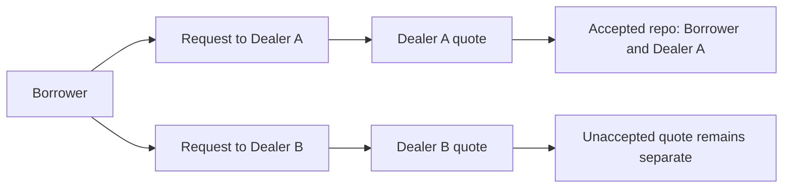

# Why privacy is required

A financing request can reveal information before a trade even occurs: how much cash a firm needs, which asset it is prepared to provide, how long it needs funding, and what price it is willing to accept. A completed position adds maturity obligations and exposure. Margin events can reveal changes in the counterparty's situation.

The product hypothesis is that treasury operators and dealers need to share these details with the relevant counterparty without automatically publishing them to every competitor. This is a workflow requirement to validate with users, not a promise of anonymity.

## Privacy changes the contract design

Symbolon creates an individual `QuoteRequest` for each dealer. Dealer A does not become an observer of Dealer B's request merely because the borrower approached both. Each quote carries its own terms. The accepted `RepoPosition` has the borrower and winning dealer as signatories.

The losing dealer can still see its own request, quote, and their cancellation or expiry-related state. It should not receive the winning rate or resulting position solely because it was asked for a quote. Inference from off-ledger communication or visible changes to its own quote is a separate issue; a ledger access test cannot prove that a party learns nothing from every possible source.

## Controlled disclosure, not secrecy from all infrastructure

The trading parties necessarily know their agreement. A participant operator hosting a party handles that party's ledger data. An issuer can observe the demo holdings it signs. Oracle readers see published marks. Local developers with administrator access to the sandbox can inspect its storage and operate its parties.

A shared participant demo establishes party-level application visibility. It does not prove infrastructure isolation from that participant's operator. Stronger operational separation requires an appropriate hosting topology, credentials, authorization and deployment testing. Digital Asset describes the node's role in its [participant architecture](https://docs.digitalasset.com/operate/3.4/overview/index.html) and [party hosting documentation](https://docs.digitalasset.com/overview/3.4/explanations/canton/external-party.html).

## What the product must avoid

- A global position list that joins private trades across counterparties.
- Public analytics containing borrower identities, accepted rates or exact maturities without authorization.
- Reusing a funding disclosure to reveal a dealer's unrelated cash balance.
- Uploading ledger payloads or wallet credentials to a marketing analytics service.
- Treating a hidden UI component as a substitute for ledger authorization.

The [privacy and trust matrix](../architecture/privacy-and-trust.md) turns these principles into implementation-level expectations and test boundaries.
