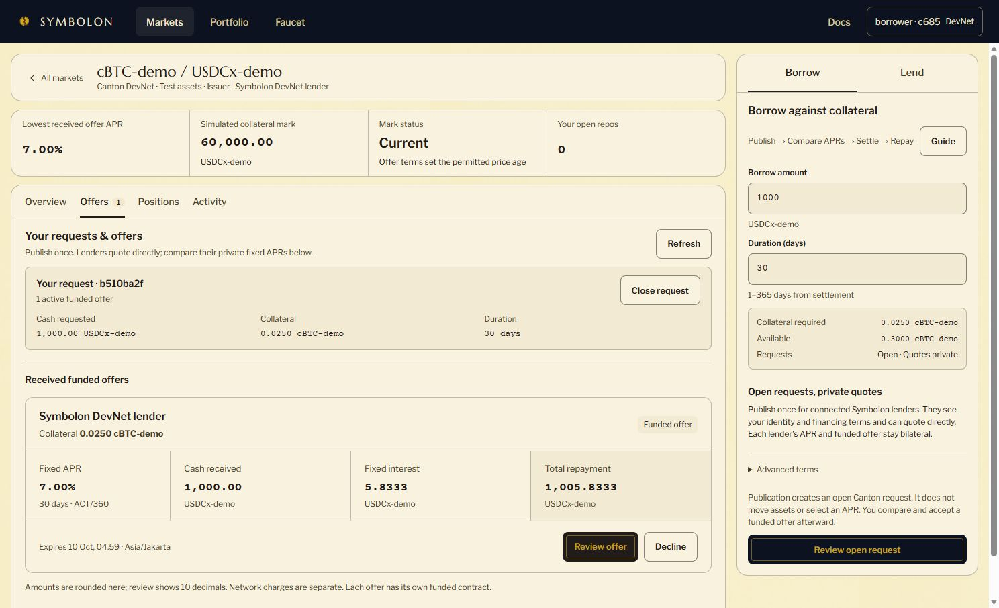
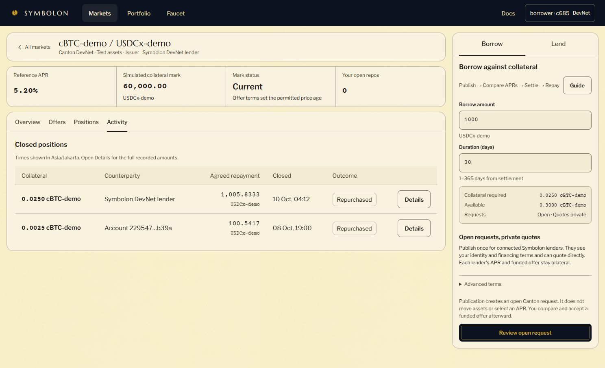

# Direct Open RFQ — shared DevNet execution

On 10 October 2026 WIB (9 October UTC), the public [Symbolon app](https://symbolon.endpx.cloud/app) completed a new direct-request financing cycle: publish an open request, send a private funded quote without lender registration or borrower access review, settle, then repurchase and recover collateral.

This was a founder-operated engineering rehearsal with two synthetic parties authorized under the same HackCanton/NODERS account on `hackcanton-devnet-3`. It used `cBTC-demo`, `USDCx-demo` and a simulated mark. It is not an external customer cycle, independent-operator deployment, native wallet signature or native cBTC/USDCx settlement.

## Actual agreement

| Field | Recorded value |
| --- | --- |
| Request ID | `b510ba2f-6663-43ae-9ddb-fb848bd5f586` |
| Borrower role | `borrower · c685` |
| Lender role | `Symbolon DevNet lender` |
| Principal | 1,000 USDCx-demo |
| Collateral | 0.0250000000 cBTC-demo |
| Fixed annualized rate | 7.00% |
| Term | 30 days from settlement, simple ACT/360 |
| Fixed interest | 5.8333333333 USDCx-demo |
| Paid repurchase price | 1,005.8333333333 USDCx-demo |
| Protocol fee collected | 0 |
| Closing outcome | `ClosedRepo: Repurchased`; collateral returned to borrower |

## Receipts and observed state

| Step | Update ID | Ledger offset / observation |
| --- | --- | --- |
| Publish `OpenRequest` | `1220062f73d040f86b531ed9f6444aa14d36b9c363027506f41dc00773ba5f504540` | `2788301`; recorded `2026-10-09T20:53:17.732302Z` |
| Fund private quote | `1220e7f09a68f09abbced38ec394f02039342fa2a2e49b3c67206060fd34981d939d` | Funded quote verified and indexed; 1,000 cash reserved |
| Accept, settle and withdraw the request | `1220f0c00dd9c3d5b1d3ff3e56f5aa6de4cc4d730df7c74a086841133cf9f9b9baf2` | `2790006`; recorded `2026-10-09T21:10:59.314348Z` |
| Repurchase | `12208ccfa9cfa152945176bb8c08de89aa05c503a244398a38c65921cfb895b7f2d8` | `2790169`; recorded `2026-10-09T21:12:14.186876Z` |

The borrower saw the 7% funded offer and exact repayment before acceptance. Settlement created one active position. After full early repayment, the active position disappeared, `Repurchased` appeared in Activity, and available collateral returned from 0.2750 to 0.3000 cBTC-demo. The request was closed in the API index with the settlement update ID and moved into the collapsed Archive. No other recorded offer existed for this request, so releasing competing quote reservations is covered by the separate Daml Script tests rather than claimed as a live result of this cycle.

The original quote committed before its first API reconciliation returned a false conflict. A database timestamp conversion had lost milliseconds when comparing its expiry with the ledger receipt. Commit `3e7bdef` preserved that precision. Retrying **only the original receipt sync** succeeded; a second quote was not submitted and cash was not reserved again.

## Package and evidence boundary

The new wrapper package `symbolon-open-rfq 0.1.0` was uploaded and vetted on the shared participant before publication. Its package ID is `53e322d473cb992c4d38889869bc7b4e0a814cc6e10af3492aa126a24735c882`. Core financing remains on package `1d40e972b56e42c279140639d33dc362b432f2c0f608c77ec36410f0395f3e19`; the existing demo faucet package and retained core/BitSafe evidence were not replaced.

The [evidence manifest](open-rfq-devnet.json) records identifiers transcribed from visible confirmed receipts and checked against the request/quote API index. It is not a raw Canton transaction export. Screenshots show the live browser state. The API index independently confirms linkage and closure; it is not the authoritative source of balances or settlement.

Publication intentionally discloses borrower identity and request terms to authenticated connected Symbolon parties. Competing quotes and accepted positions remain bilateral. Operators, issuers and overlapping-party rights remain trust and disclosure boundaries. These engineering transactions do not change customer, interview, pilot or revenue counts.

The separate BitSafe Contribution Pool proof remains the reproducible three-participant LocalNet governance integration. This shared-DevNet direct-quote cycle is product evidence, not a Gold deployment claim.
