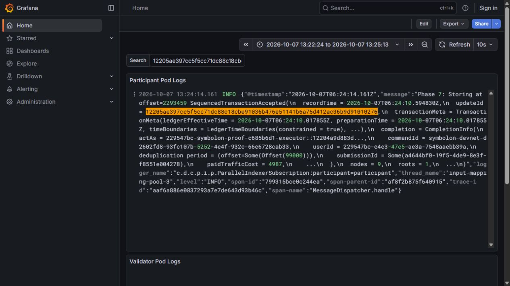

# Shared DevNet repo and governed oracle evidence

On **7 October 2026**, Symbolon completed a repo lifecycle on NODERS shared HackCanton DevNet. A BitSafe governance action changed a simulated oracle mark only after two confirmations; that mark caused a margin call, followed by collateral top-up and repurchase. The retained run contains **20 committed transactions, one expected Daml rejection and five timestamped state snapshots**.

This run used the actual shared participant and JSON Ledger API with the application's action builders. The instruments are **cBTC-demo / USDCx-demo**, and all seven parties are controlled by one account on one participant. There is no DecMan service, decentralized-party hosting, installed-wallet signing or real-token settlement in this artifact. The separate [three-participant LocalNet evidence](bitsafe-localnet.json) demonstrates the DecMan topology for Contribution Pool.

## Environment

| Field | Value |
| --- | --- |
| Run | d2602fd8 |
| Canton | 3.5.19 |
| Participant | hackcanton-devnet-3::12204a9d883d1158141d8f099d06dd2e42cb52615deb42da5a46f042c8d0e1dbdf0e |
| Synchronizer | global-domain::1220be58c29e65de40bf273be1dc2b266d43a9a002ea5b18955aeef7aac881bb471a |
| Endpoint | https://ledger-api-json.participant.hackcanton-01.devnet.naas.noders.services |
| Completed | 2026-10-07T06:24:43.782Z (13:24 WIB) |
| Ledger offsets | 2293352 → 2293507 |
| Source base revision | 5ae94796a71acb9eb17c82e4a9fd49aaec6402e4; exact executed file hashes are retained in the JSON |
| Outcome | Repurchased |

## Before and after the governed mark

| Snapshot | Recorded at (UTC) | Ledger offset | Price | Pledged cBTC-demo | Health factor | Repo state |
| --- | --- | --- | --- | --- | --- | --- |
| Before governed mark | 2026-10-07T06:23:55.160Z | 2293432 | 60000 | 0.025 | 1.428571 | Active |
| After governed mark | 2026-10-07T06:24:15.531Z | 2293461 | 36000 | 0.025 | 0.857143 | Active |
| Margin call | 2026-10-07T06:24:19.768Z | 2293473 | 36000 | 0.025 | 0.857143 | UnderCall |
| Margin restored | 2026-10-07T06:24:30.483Z | 2293491 | 36000 | 0.03 | 1.028571 | Active |
| Repurchased | 2026-10-07T06:24:43.370Z | 2293507 | 36000 | returned | closed | Repurchased |

The principal is **1,000 USDCx-demo**, the accepted annualized rate is **5.2%**, and the agreed repurchase amount is **1,004.3333333333 USDCx-demo**. Required collateral value is 1,050, calculated from principal and the agreed 1.05 margin multiplier. It stays unchanged when the price falls from 60,000 to 36,000. Adding 0.005 cBTC-demo restores pledged value from 900 to 1,080. Repurchase returns all 0.03 pledged cBTC-demo; the borrower ends with 0.1 unlocked cBTC-demo and 1,995.6666666667 USDCx-demo.

## Ledger receipts

Each link filters the operator's Grafana dashboard by the exact committed update ID and a fixed time range. Availability and log retention are controlled by NODERS. These are node-log lookups, not a public Canton explorer.

| Step | Action | Result | Offset | Recorded at (UTC) | Update ID / error |
| --- | --- | --- | --- | --- | --- |
| 1 | Create 2-of-3 rules | committed | 2293362 | 2026-10-07T06:23:05.599675Z | [12209fd74d56b76f3527cd703eaad709b821a20997462d3070e7e62c1d5d1ea8ef1f](https://grafana.participant.hackcanton-01.devnet.naas.noders.services/?orgId=1&from=1791354144466&to=1791354313782&timezone=browser&var-search=12209fd74d56b76f3527cd703eaad709b821a20997462d3070e7e62c1d5d1ea8ef1f) |
| 2 | Governed initialization: proposal | committed | 2293371 | 2026-10-07T06:23:11.009295Z | [122057f5edc13b56969eb47e8d8161afa7808832b48efd72c770908c78736333d93e](https://grafana.participant.hackcanton-01.devnet.naas.noders.services/?orgId=1&from=1791354144466&to=1791354313782&timezone=browser&var-search=122057f5edc13b56969eb47e8d8161afa7808832b48efd72c770908c78736333d93e) |
| 3 | Governed initialization: confirmation | committed | 2293374 | 2026-10-07T06:23:16.414858Z | [1220741c67a6f3c6b707dddd124683709c252fadab9ac5d277768bc23b5b16297109](https://grafana.participant.hackcanton-01.devnet.naas.noders.services/?orgId=1&from=1791354144466&to=1791354313782&timezone=browser&var-search=1220741c67a6f3c6b707dddd124683709c252fadab9ac5d277768bc23b5b16297109) |
| 4 | Governed initialization: confirmation | committed | 2293380 | 2026-10-07T06:23:19.033013Z | [12202fbbd5b8e8a3851b5e10985303f98a7cb5111b88c5c0d376223e54f9ee541afa](https://grafana.participant.hackcanton-01.devnet.naas.noders.services/?orgId=1&from=1791354144466&to=1791354313782&timezone=browser&var-search=12202fbbd5b8e8a3851b5e10985303f98a7cb5111b88c5c0d376223e54f9ee541afa) |
| 5 | Governed initialization: execute with two confirmations | committed | 2293383 | 2026-10-07T06:23:22.884408Z | [12209d636c697ae1f4faaee0b797bf560d6ba1977fca485599e04d01d4a4f03dad6d](https://grafana.participant.hackcanton-01.devnet.naas.noders.services/?orgId=1&from=1791354144466&to=1791354313782&timezone=browser&var-search=12209d636c697ae1f4faaee0b797bf560d6ba1977fca485599e04d01d4a4f03dad6d) |
| 6 | Issue isolated simulated holdings | committed | 2293389 | 2026-10-07T06:23:26.862519Z | [122033d662faa4dd47da69a3ff4da9a5ed6906680701cb61f6bf4ffb4bac9429cec7](https://grafana.participant.hackcanton-01.devnet.naas.noders.services/?orgId=1&from=1791354144466&to=1791354313782&timezone=browser&var-search=122033d662faa4dd47da69a3ff4da9a5ed6906680701cb61f6bf4ffb4bac9429cec7) |
| 7 | Create private RFQ | committed | 2293395 | 2026-10-07T06:23:29.837776Z | [1220204d9b74a074032e212f21d0657b5aaa2ca97ea29c4cb81834214d1c62006d65](https://grafana.participant.hackcanton-01.devnet.naas.noders.services/?orgId=1&from=1791354144466&to=1791354313782&timezone=browser&var-search=1220204d9b74a074032e212f21d0657b5aaa2ca97ea29c4cb81834214d1c62006d65) |
| 8 | Prepare exact holding for dealer | committed | 2293408 | 2026-10-07T06:23:35.507924Z | [122079f2bb9d468e27ef9da4cbdcf2f83c68b46e3ee6d9ee66fdc8b4cf7397ac2765](https://grafana.participant.hackcanton-01.devnet.naas.noders.services/?orgId=1&from=1791354144466&to=1791354313782&timezone=browser&var-search=122079f2bb9d468e27ef9da4cbdcf2f83c68b46e3ee6d9ee66fdc8b4cf7397ac2765) |
| 9 | SubmitQuote | committed | 2293413 | 2026-10-07T06:23:40.676807Z | [1220b6ccc65c46db7b354729523198314657d81980e29669f3489a4bfe56e96c7984](https://grafana.participant.hackcanton-01.devnet.naas.noders.services/?orgId=1&from=1791354144466&to=1791354313782&timezone=browser&var-search=1220b6ccc65c46db7b354729523198314657d81980e29669f3489a4bfe56e96c7984) |
| 10 | Prepare exact holding for borrower | committed | 2293421 | 2026-10-07T06:23:46.870190Z | [122080ed222044246e3d16b2cad7ee25d9d7dfbcf152c56aa2f15b09f4f8c8fabe38](https://grafana.participant.hackcanton-01.devnet.naas.noders.services/?orgId=1&from=1791354144466&to=1791354313782&timezone=browser&var-search=122080ed222044246e3d16b2cad7ee25d9d7dfbcf152c56aa2f15b09f4f8c8fabe38) |
| 11 | AcceptQuote | committed | 2293427 | 2026-10-07T06:23:52.196024Z | [1220207045d43dc51d4856fa4c60b7dc5c49341323fbc416764bdc8b18292bf18bfe](https://grafana.participant.hackcanton-01.devnet.naas.noders.services/?orgId=1&from=1791354144466&to=1791354313782&timezone=browser&var-search=1220207045d43dc51d4856fa4c60b7dc5c49341323fbc416764bdc8b18292bf18bfe) |
| 12 | Governed price mark: proposal | committed | 2293435 | 2026-10-07T06:23:57.200180Z | [122052bb03e937f28ca691003451f7d1d8fb83f269d1fdd4816a3f80bd19b4e7af12](https://grafana.participant.hackcanton-01.devnet.naas.noders.services/?orgId=1&from=1791354144466&to=1791354313782&timezone=browser&var-search=122052bb03e937f28ca691003451f7d1d8fb83f269d1fdd4816a3f80bd19b4e7af12) |
| 13 | Governed price mark: confirmation | committed | 2293442 | 2026-10-07T06:24:01.046730Z | [122083670b6c2a10ceab32768d3987f5b35ab27a6563292b8d7a5383153accb0d20e](https://grafana.participant.hackcanton-01.devnet.naas.noders.services/?orgId=1&from=1791354144466&to=1791354313782&timezone=browser&var-search=122083670b6c2a10ceab32768d3987f5b35ab27a6563292b8d7a5383153accb0d20e) |
| 14 | Governed price mark: one confirmation must fail | expected rejection | — | 2026-10-07T06:24:03.858Z | DAML_FAILURE: Enough confirmations to execute action |
| 15 | Governed price mark: confirmation | committed | 2293450 | 2026-10-07T06:24:07.727851Z | [122053bce12649a5cfa2d7df334532be0d1a4fd6c587d7c4c3b1553620a8b639cc37](https://grafana.participant.hackcanton-01.devnet.naas.noders.services/?orgId=1&from=1791354144466&to=1791354313782&timezone=browser&var-search=122053bce12649a5cfa2d7df334532be0d1a4fd6c587d7c4c3b1553620a8b639cc37) |
| 16 | Governed price mark: execute with two confirmations | committed | 2293459 | 2026-10-07T06:24:10.594830Z | [12205ae397cc5f5cc71dc88c18cbe91036b476e51141b6a75d412ac36b9d91010276](https://grafana.participant.hackcanton-01.devnet.naas.noders.services/?orgId=1&from=1791354144466&to=1791354313782&timezone=browser&var-search=12205ae397cc5f5cc71dc88c18cbe91036b476e51141b6a75d412ac36b9d91010276) |
| 17 | IssueMarginCall | committed | 2293463 | 2026-10-07T06:24:16.616054Z | [12200a437e011eba498503c3e1bb1328e9326eb8a34406c7c2c7227e82dbce45a139](https://grafana.participant.hackcanton-01.devnet.naas.noders.services/?orgId=1&from=1791354144466&to=1791354313782&timezone=browser&var-search=12200a437e011eba498503c3e1bb1328e9326eb8a34406c7c2c7227e82dbce45a139) |
| 18 | Prepare exact holding for borrower | committed | 2293475 | 2026-10-07T06:24:21.135961Z | [1220a01105d9240ef2ff2a5230ac11bcb4d93a80fa9793c4505627b81195b4fe8f97](https://grafana.participant.hackcanton-01.devnet.naas.noders.services/?orgId=1&from=1791354144466&to=1791354313782&timezone=browser&var-search=1220a01105d9240ef2ff2a5230ac11bcb4d93a80fa9793c4505627b81195b4fe8f97) |
| 19 | TopUpCollateral | committed | 2293485 | 2026-10-07T06:24:26.598837Z | [122040f7467b9fe13d1e7ce5a2f78cb2b8bd0210cea876cc37b453c74170d8484e9a](https://grafana.participant.hackcanton-01.devnet.naas.noders.services/?orgId=1&from=1791354144466&to=1791354313782&timezone=browser&var-search=122040f7467b9fe13d1e7ce5a2f78cb2b8bd0210cea876cc37b453c74170d8484e9a) |
| 20 | Prepare exact holding for borrower | committed | 2293492 | 2026-10-07T06:24:33.262867Z | [12208bd8fa7e43fd649d326bc82296c849b2ecc8257af1902771dbf57def8924fd38](https://grafana.participant.hackcanton-01.devnet.naas.noders.services/?orgId=1&from=1791354144466&to=1791354313782&timezone=browser&var-search=12208bd8fa7e43fd649d326bc82296c849b2ecc8257af1902771dbf57def8924fd38) |
| 21 | Repurchase | committed | 2293501 | 2026-10-07T06:24:37.467172Z | [122096b884fadc949c2fb9c83a32495a3ef5c2c3f0ed9f619f35cf884dfea6831050](https://grafana.participant.hackcanton-01.devnet.naas.noders.services/?orgId=1&from=1791354144466&to=1791354313782&timezone=browser&var-search=122096b884fadc949c2fb9c83a32495a3ef5c2c3f0ed9f619f35cf884dfea6831050) |

The negative case remains `failed-or-unconfirmed` in the original journal because that is the runner's generic error status. Its actual response is the expected Daml assertion failure, and the runner re-read the old mark before accepting a second confirmation. The successful mark receipt contains `GovernanceRules_ExecuteConfirmedAction`, two `GovernanceConfirmation_Consume` events, `GovernableAction_Execute` and `SetPrice`. The margin receipt contains `IssueMarginCall`, and the closing receipt contains `Repurchase`.

## Operator-log corroboration

The NODERS participant log was re-read through its Grafana UI after completion. It independently displayed the governed-mark update at offset **2293459** and the repurchase update at offset **2293501**, with the same command IDs and record times retained in the API receipts. The screenshots capture that operator surface, rather than a local Symbolon simulation.




Source: NODERS Participant Pod Logs, filtered to this run's exact update IDs and UTC time range.

## Verify the retained record

```bash
node scripts/verify-shared-devnet-evidence.mjs
```

This read-only command validates receipt correlation, unique update IDs, offsets, the expected rejection, fixed repurchase amount, health-factor changes, final unlocked balances and source-file hashes. The [source manifest](shared-devnet-sources.json) retains the captured byte hashes and LF-normalized hashes so Windows CRLF and Linux LF checkouts can verify the same source; only line endings are normalized. It checks retained-record consistency and does not contact a ledger or establish authenticity by itself. External corroboration uses the operator log links above, or an authorized Ledger API transaction re-read with the party mapping in [shared-devnet.json](shared-devnet.json).

Artifact SHA-256: `c8a90bdd2818b7cdad5b8a53584f921702c85a11a11c1681bba711fdc0d267ad`. The public JSON retains original receipts and state; private credentials, account provisioning and unrelated diagnostic logs are excluded.
